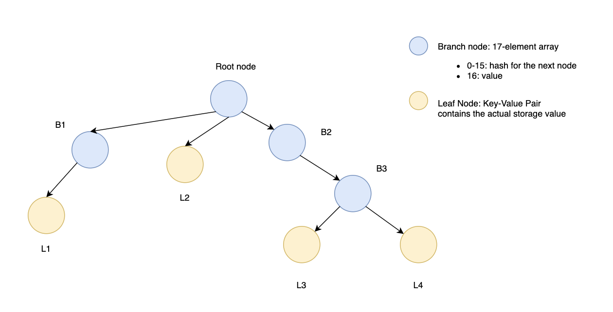

# Optimized storage proof

## Layout

The proof obtained via the `eth_getProof`  RPC endpoint: [EIPs/eip-1186.md at master · ethereum/EIPs · GitHub](https://github.com/ethereum/EIPs/blob/master/EIPS/eip-1186.md) contains the `storageProof` Array of rlp encoded storage-entries, one entry for each provided `key`. Every storage entry has the following properties:

* `key`: the storage key as requested in the `eth_getProof`
* `value`: the storage value of the address stored for the `key`
* `proof`: Array of all the rlp-serialized MerkleTree-Nodes, starting with the root node of the storage Patricia-trie, following the path of the `key`.

The Patricia-Merkle-Tree is described in the wiki greater detail: [patricia-tree | Ethereum Wiki](https://eth.wiki/fundamentals/patricia-tree)

If a contract contains more than one keys (e.g. two variables that have a value). The root node of the storage trie is guaranteed to be a branch node. Therefor all `proof` arrays in each storage-entry of the `storageProof` array start with the identical root node (branch) and can therefor be optimized. Instead of sending a `proof` array each for every key, the layout can be compressed.

Considering following storage-trie layout:

All individual storage proofs share at least the root node. Leaf nodes L3 and L4 share 3 branch nodes (root-B2-B3) as their parents and can therefor be optimized into a single proof with identical path until B3. 
The optimized proof that bundles every individual `proof` is a tree structure. Every node (`proof-node`) in this new proof can be expressed with following properties:
	* `branches`: an Array of RLP-encoded branch nodes that can be consolidated. The last branch node in `branches` is the deepest node that the underlying leaf nodes share as one of their parent nodes
	* `values`: an Array that contains either the terminating `leaf-node` directly or in the case of a continued path another `proof-node`.
	
A terminating `leaf-node` contains:
* `key`: the storage key (as described aboth)
* `value`: the storage value (as described aboth)

For the example this means, the initial `proof-node` contains a single branch (root node) in `branches` and 3 entries in values. For L1 the initial `proof-node` contains another `proof-node` with exactly 1 branch (B1). For L2 it contains the `leaf-node` directly. For L3 and L4 contains a single `proof-node` with branch nodes [B2, B3], this `proof-node` then contains the `leaf-nodes` L3, L4 directly.

## Encoding and Modifying

To verify that the new proof passed refers to the current state of the proxy, all values of the storage entries in the proof must be replaced with the current values of the proxy and so the storage hash of the proxy has to be determined. To adjust the passed proof the values for the respective storage key have to be read from the contract storage and then the nodes have to be updated upwards to the proof path. All proof nodes are rlp encoded analog to the ethereum patricia tree. RLP-encoding is described in detail in the wiki: [patricia-tree | Ethereum Wiki](https://eth.wiki/fundamentals/patricia-tree). A leaf node, that holds the final value consists of an array with two entries: the encoded path and the value. A parent branch node that references the leaf node stores the hash of the leaf node at its corresponding index. The hash is cumputed by `sha3(rlp([rlp(encodedPath), rlp(value)])`.
After modifying the leaf node's value this hash has to be computed and replaced in the node's parent branch. then the parent branch has to be hashed again to be updated in its parent branch. This is repeated until the final root branch node is reached. Hashing the root branch node then leads to the actual storage hash that can be compared against the relayed storage hash in the relay contract.